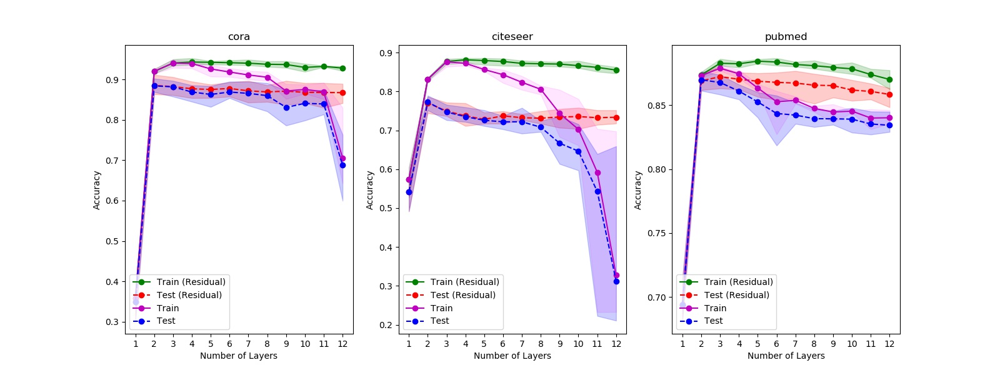

# A Survey of Dimensionality Reduction Techniques

<br> Authors: Xingyu Chen and Junyoung Lim </br> 

## NOTE: `image_model/data` directory should have:
```bash
data/
├── _config.yml
├── cifar10/ 
    ├── data_batch_1
    ├── data_batch_2
    ├── data_batch_3
    ├── data_batch_4
    ├── data_batch_5
    └── test_batch
```

## Graph Models

<b> A Evoluation Plot for Graph Convolution Network on 4-label dataset </b> 

<p align="center">
   
   <br>
   <b>GCN training on the the Karate Club Netowkr Dataset</b>
</p>

<b> A Evoluation Plot for Graph Convolution Network on 2-label dataset </b> 

<p align="center">
   
   <br>
   <b>GCN training on the the Karate Club Netowkr Dataset</b>
</p>

<b> A model depth analysis for Graph Convolution Network. 5-fold cross validation perforamnce of GCN and GCN with residual connections on the 3 Benchmark Datasets. Shaded area indicate the variance of change </b> 



### Folders:

* <b>data: contains the Karate club toy dataset, three benmark dataset for semi-supervised learning: Cora, Citeseer
and Pubmed, and a large network dataset:GSN</b>

* <b>images: a folder of genrated visualzation plot </b>

* <b>video: two videos of showing how GCN model improves during the traning process (GCN model applied on the toy dataset)  </b>


### Python Scripts:

* <b>models.py: It contains the GCN, GCN with residual connection and GAT models  </b>

* <b>spectrum_embedding.py: It contains the code to run spectrum embedding model under a supervised task </b>

* <b>tsne.py: It contains the code to run tsne model under a supservised task (Note for t-sne we use the off the shelf implementation from scikit-learn) </b>

* <b>train_utlis: utlis class for training neural model including metrics and evaltion script </b>

* <b>plot_utlis: utlis class for plotting graph </b>

* <b>plot.py: a script to plot results for showing impact of nerual model depth and contain a plot function for wall clock time analysis </b>


### Notebooks:

* <b>visualization.ipynb : a notebook contains the code to genarate visualizations for qualitative analysis.</b>

* <b>Model.ipynb : a notebook contains the code to compare model perforances quantatively and contains code segment that demnonstartes how to run the the implemented models. The notebook is to analyze semi-supervised perforamnce of the implemented graph nerual model.</b>
